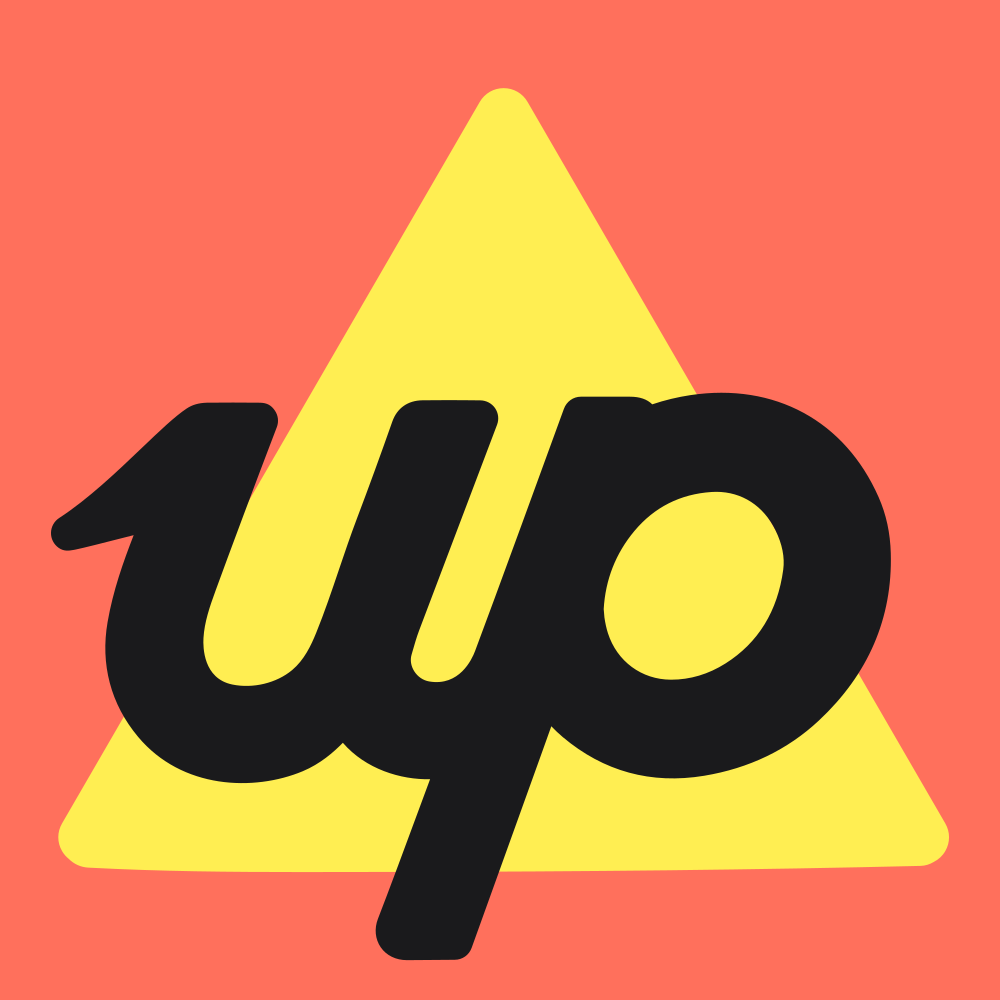

<a id="readme-top"></a>
<br />
<div align="center">
  <a href="https://up.com.au/">
    
  </a>

  <h3 align="center">Up</h3>

  <p align="center">
    An unofficial Go package for the Up Open Banking API
    <br />
    <a href="https://developer.up.com.au/#welcome"><strong>Explore Up's API docs »</strong></a>
    <br />
    <br />
    <!-- TODO check if links work once committed -->
    &middot;
    <a href="https://github.com/jaydenthomson-mantel/up/issues/new?labels=bug&template=bug-report---.md">Report Bug</a>
    &middot;
    <a href="https://github.com/jaydenthomson-mantel/up/issues/new?labels=enhancement&template=feature-request---.md">Request Feature</a>
  </p>
</div>

## About The Project
This go package can be used in your own go projects if you'd like to integrate
with Up's Open Banking API. I say it's unofficial because this is just a passion
project and I am in no way affiliated with the bank Up.

<p align="right">(<a href="#readme-top">back to top</a>)</p>

### Built With

Built with Go and the following third party packages:
- TBC

<p align="right">(<a href="#readme-top">back to top</a>)</p>

## Getting Started
### Prerequisites

To use this package like any other go package you need to install go. 
Instructions can be found [here](https://go.dev/doc/install). You also need to 
initialize a go.mod file.
```sh
go mod init github.com/OWNER_NAME/REPO_NAME
```

### Installation
Use the go get command to add the package as a dependency to your module
```sh
go get github.com/jaydenthomson-mantel/up
```

### Updates
To update to the latest, use the same command for installation but specify latest
```sh
go get github.com/jaydenthomson-mantel/up@latest
```
You can use a specific version by replacing latest with the version you want.
```sh
go get github.com/jaydenthomson-mantel/up@v1.0.1
```
If you like to update to the latest version without changing your major version,
you can run the same as the install command but add the `-u` flag.
```sh
go get -u github.com/jaydenthomson-mantel/up
```


<p align="right">(<a href="#readme-top">back to top</a>)</p>

## Usage
You will be making API requests through the Up Client object. This is a struct with a net/http Client inside it and should be reused as much as possible.
```go
upClient := up.NewClient()
accounts, err := upClient.GetAccounts("up:yeah:YOUR_TOKEN",
  &up.PaginationParams{PageSize: "1"})

if err != nil {
  fmt.Println(err)
  os.Exit(1)
}

transactions, err := upClient.GetTransaction("5bbb5317-ff35-4310-b838-25394fd57496",
  "up:yeah:YOUR_TOKEN",
  &up.PaginationParams{PageSize: "1"})

if err != nil {
  fmt.Println(err)
  os.Exit(1)
}
```
<p align="right">(<a href="#readme-top">back to top</a>)</p>

## Contributing
Will be keen for contributors once the package is more mature. If you have 
any recommendations or problems you'd like to resolve please add an issue.

### Top contributors:
<a href="https://github.com/jaydenthomson-mantel/up/graphs/contributors">
  
</a>

<p align="right">(<a href="#readme-top">back to top</a>)</p>

## License
Distributed under the MIT License. See `LICENSE` for more information.

<p align="right">(<a href="#readme-top">back to top</a>)</p>

## Acknowledgments
* [othneildrew - README Template](https://github.com/othneildrew/Best-README-Template)
* [contrib.rocks - Contributors Image Generation](https://contrib.rocks)

<p align="right">(<a href="#readme-top">back to top</a>)</p>